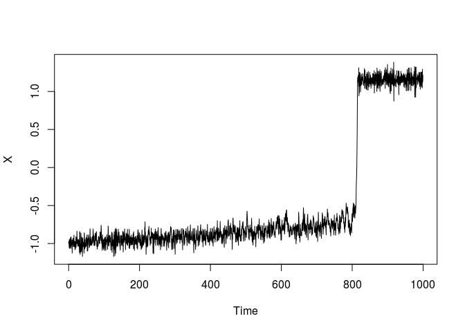
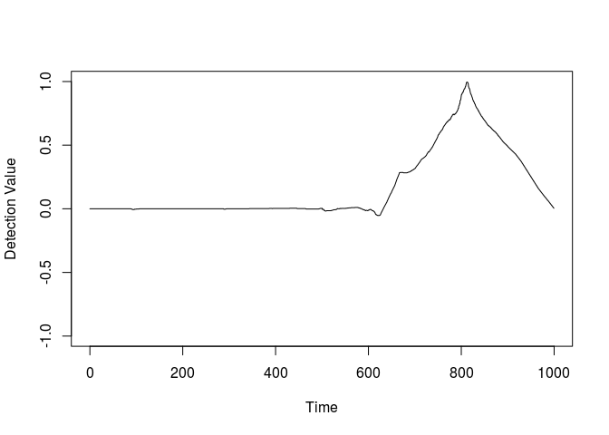
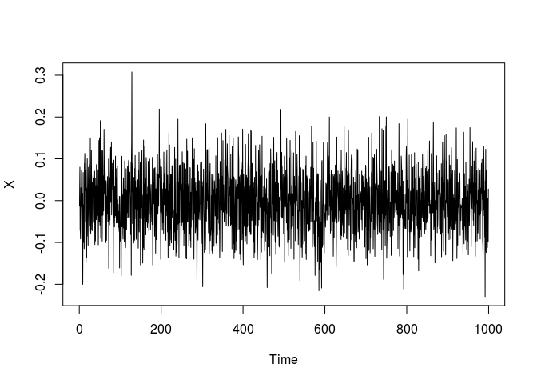
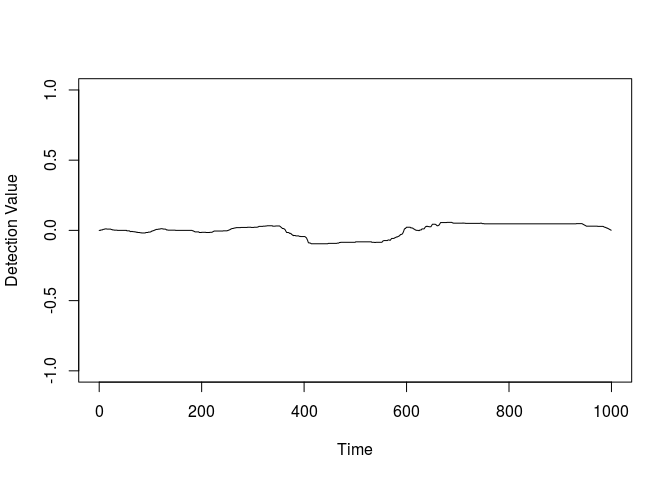

<!-- README.md is generated from README.Rmd. Please edit that file -->
asdetect
========

asdetect is used to detect abrupt shifts in time series, by searching for large changes in gradient over a small time

Installation
------------

You can install asdetect using:

``` r
#install.packages('devtools')
devtools::install_github("caboulton/asdetect")
```

Usage
-----

The below example shows how to the functions work on an example time series, using the as\_detect() function:

``` r
eg1 <- tip_eg() #create a time series with an abrupt shift in it
plot(eg1, type="l", xlab='Time', ylab='X')
```



``` r
detect1 <- as_detect(eg1$x, dt=0.5) #run the detection algorithm
plot(detect1, type="l", xlab='Time', ylab='Detection Value', ylim=c(-1,1))
```



A time series of white noise will have no detection of an abrupt shift:

``` r
eg2 <- white_noise_eg() #create a time series of white noise
plot(eg2, type="l", xlab='Time', ylab='X')
```



``` r
detect2 <- as_detect(eg2$x, dt=0.5) #run the detection algorithm
plot(detect2, type="l", xlab='Time', ylab='Detection Value', ylim=c(-1,1))
```



Using both detection objects we can determine if a shift has occurred using where\_as():

``` r
print(where_as(detect1$detect, dt=0.5)) #finds the minima or maxima of the detection time series above the default 0.7 threshold
#> $as_pos
#> [1] 774.5
#> 
#> $dt_val
#> [1] 0.7009063
print(where_as(detect2$detect, dt=0.5)) #warning message displayed if none can be found
#> [1] "Threshold not detected, maximum returned instead"
#> $as_pos
#> [1] 829
#> 
#> $dt_val
#> [1] -0.09516616
```

It is important to note that depending o whether or not 'dt' is specified, depends on how inputs are used in follow-on functions. Information is provided in the individual help files of each function.

asdetect also includes shift\_type() which determines whether a detected abrupt shift is a true shift or whether it is a flat section of an otherwise increasing/decreasing time series. Again, full information is provided in the help file.
